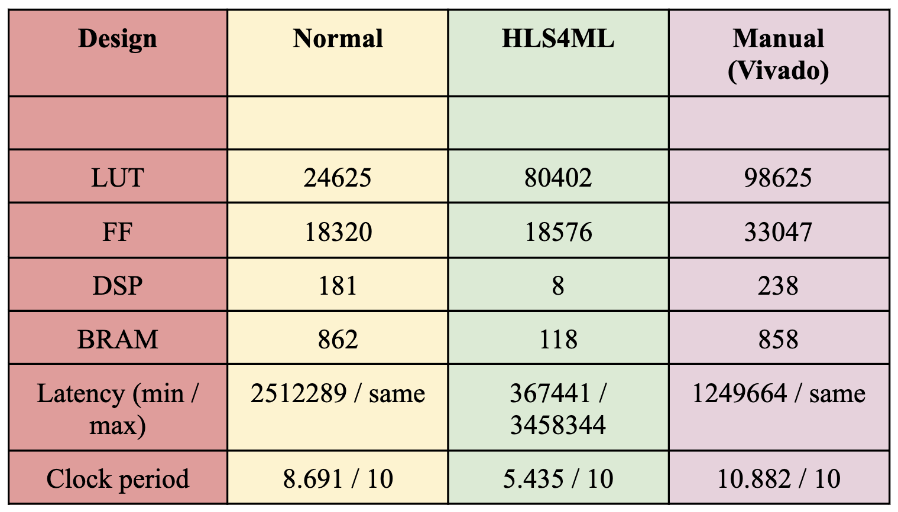

# HLS-Vivado-Brain-Tumor-Detection-Optimization
Optimized a brain tumor detection model, initially running it through the HLS4ML tool to achieve a latency range of 367,441 to 3,458,344 cycles. Converted the design to C and manually optimized it in Vivado, successfully reducing the latency to 1,249,664 cycles, approaching the performance of the HLS4ML-optimized model.

## Project Overview

This project focuses on optimizing a brain tumor detection model using High-Level Synthesis (HLS) tools. The initial model was run through the HLS4ML tool, and further optimizations were carried out manually using Vivado HLS to improve latency and performance.

## Project Details

- **Duration**: July 2023 - January 2024
- **Supervisor**: Dr. Chandan Karfa, Associate Professor, Dept. of CSE, IIT Guwahati
- **Tools Used**: HLS4ML, Vivado HLS, Vivado

## Objectives

1. To optimize the latency of a brain tumor detection model.
2. To compare performance between the HLS4ML-optimized model and manually optimized models using Vivado.
3. To analyze the impact of different optimization techniques on hardware utilization and latency.

## Performance Summary

### HLS4ML Optimization Results

- **Latency**: 367,441 to 3,458,344 clock cycles
- **Estimated Timing**: 5.435 ns
- **Clock Uncertainty**: 0.62 ns
- **Pipeline Type**: Dataflow

### Vivado HLS Optimization Results

- **Minimum Latency**: 1,249,664 clock cycles (reduced from HLS4ML)
- **Optimized Timing**: 8.691 ns
- **Target Device**: xcvu13p-flga2577-2-e
- **Clock Period**: 10.00 ns

## Utilization Estimates

- **BRAM**: 118 (2% of available resources)
- **DSP**: 8 (~0% of available resources)
- **Flip-Flops (FF)**: 18,576 (~0% of available resources)
- **LUTs**: 80,402 (4% of available resources)
- **URAM**: 0

## Results and Analysis

The following table summarizes the comparison between Normal, HLS4ML, and Manual (Vivado) implementations of the brain tumor detection model:




The table provides insights into the utilization of resources such as Look-Up Tables (LUTs), Flip-Flops (FF), Digital Signal Processing blocks (DSP), Block RAMs (BRAM), latency in clock cycles, and clock period for each design approach.

### Cosimulation Reports

- **Optimized Cosimulation Report**:
  - Minimum, average, and maximum latency: 1,249,664 clock cycles [Source: solution1_braintumer_cosim_6_try.html].
  
- **Unoptimized Cosimulation Report**:
  - Minimum, average, and maximum latency: 2,512,289 clock cycles [Source: solution1_braintumer_cosim_unoptimized.html].

### Synthesis Reports

- **Optimized Synthesis Report**: Detailed utilization and performance estimates available in `solution1_braintumer_csynth_6_try.html`.
- **Unoptimized Synthesis Report**: Detailed utilization and performance estimates available in `solution1_braintumer_csynth_unoptimized.html`.

## How to Run the Project

1. **Setup Vivado HLS Environment**: Install Vivado HLS and set up the environment on your local machine.
2. **Clone Repository**:
    ```bash
    git clone https://github.com/yourusername/Brain-Tumor-Detection-HLS-Optimization.git
    ```
3. **Navigate to Project Directory**:
    ```bash
    cd Brain-Tumor-Detection-HLS-Optimization
    ```
4. **Run HLS4ML Optimization**:
    - Follow the instructions in the `hls4ml_optimization.md` file.
5. **Run Vivado HLS Optimization**:
    - Execute the Vivado project using the provided scripts.

<!-- ## Issues and Challenges

1. **High Latency in Initial Models**: The initial model's latency was very high, ranging up to 3,458,344 cycles, which required significant optimization.
2. **Resource Utilization**: Efficient utilization of BRAM and DSP resources was necessary to meet hardware constraints while optimizing latency.
3. **Clock Constraints**: Ensuring timing constraints were met with a targeted clock period of 10 ns, which required careful pipelining and optimization. -->

## Issues and Challenges with HLS4ML

During the implementation of the brain tumor detection model optimization using HLS4ML, several issues were encountered. Below is a summary of the problems faced, the solutions implemented, and the challenges in working with HLS4ML:

### Dependencies and Versions Used for HLS4ML

- **hls4ml (0.8.1)**: Main package installed for high-level synthesis.
- **calmjs.parse (1.3.1)**, **h5py**, **numpy**, **onnx (1.15.0)**, **pydigitalwavetools (1.1)**, **pyyaml**, **qkeras (0.9.0)**, **tabulate**, **tensorflow (2.14.0)**, **protobuf (4.25.3)**, **setuptools (68.2.2)**, **ply (3.11)**, **scipy (1.12.0)**, **pyparser (1.0)**, **tensorflow-model-optimization (0.8.0)**, **networkx (3.1)**, **keras-tuner (1.4.7)**, **scikit-learn (1.2.2)**, **tensorflow-intel (2.14.0)**, **tensorboard (2.14.1)**, and others were required to ensure compatibility and functionality.

### Issues Solved During Installation of Package Dependencies

#### Problem:

Some package dependencies required specific versions that differed from those previously installed on our system, causing conflicts.

- **Example**: TensorFlow's required version was <=2.14.0, but version 2.16.0 was installed.

#### Solution:

1. Uninstalled the existing incompatible version of TensorFlow:
    ```bash
    pip uninstall tensorflow
    ```
2. Installed the specific required version:
    ```bash
    pip install tensorflow==2.14.0
    ```

#### Outcome:

Successfully resolved version compatibility issues by downgrading to the required TensorFlow version, ensuring that all dependencies met the specified requirements.

### Issue: C Synthesis Report Not Found

#### Problem:

Encountered an error indicating that the C synthesis report was not found when running the model on HLS4ML within a Windows environment.

#### Solution:

1. **Troubleshooting in Windows**: Attempted to locate the C synthesis report within the Windows environment, but was unsuccessful.
2. **Switch to Linux-Based System (Ubuntu)**: Transitioned to a Linux-based Ubuntu system, where the model was successfully run, and the required C synthesis report was generated without issues.

### Initial Clock Setting Discrepancy

- **Problem**: The default clock was set to 5 nanoseconds, conflicting with the Vivado HLS-generated code that used a 10-nanosecond clock period.
- **Solution**: Adjusted the clock period variable in `build_prj.tcl` to 10 nanoseconds to match Vivado HLS settings, ensuring consistency.
- **Outcome**: Clock period alignment was achieved, resulting in a consistent design environment.

### enable_dsp_full_reg

- Enabled setting of `enable_dsp_full_reg` to fully register DSP blocks for high-speed arithmetic operations.
- Decision to comment out this line was made based on specific project design constraints, where the default behavior of the HLS tool was more suitable.

### Synthesis Challenges in Fixed-Point Neural Networks

- Encountered issues such as:
    - **Warning**: Long runtime due to the high number of load/store instructions.
    - **Error**: Unsupported number of load/store instructions for fixed-point data types in dense layers.
    - **Solution**: Specified fixed-point data types with proper range settings to prevent out-of-bound errors.

### Array Partitioning Errors in `nnet_dense_latency.h`

- Encountered errors during array partitioning due to exceeding element thresholds, leading to runtime issues.
- Removed `pragma` directives for array partitioning to resolve these errors.

### Resource Management and Multiplication Operations

- Adjusted `pragma` settings to control DSP block utilization, balancing performance and resource usage.
- Removed restrictive `pragma` settings when they limited necessary resource allocation.

### Conclusion

These issues and solutions highlight the complexities of working with HLS4ML for optimizing FPGA-based neural networks, particularly in managing dependencies, ensuring compatible configurations, and handling synthesis challenges effectively.


## Future Work

- Further optimization of the pipeline to reduce latency below 1 million cycles.
- Exploration of additional HLS directives and optimizations to enhance hardware resource utilization.
- Integration of more complex models for improved accuracy and robustness.

## Contributions

- **Dhruvkumar Kakadiya**: Model implementation, HLS4ML optimization, Vivado manual optimization, performance analysis.
- **Ajay Rajpurohit**
- **Kishan Thakkar**
- **Gautam Gandhi**
